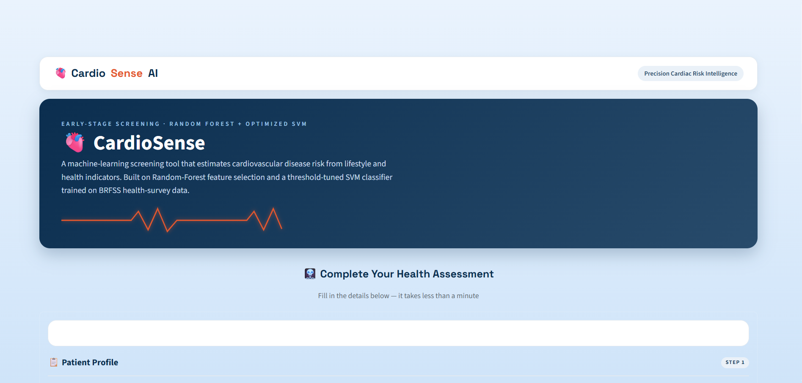
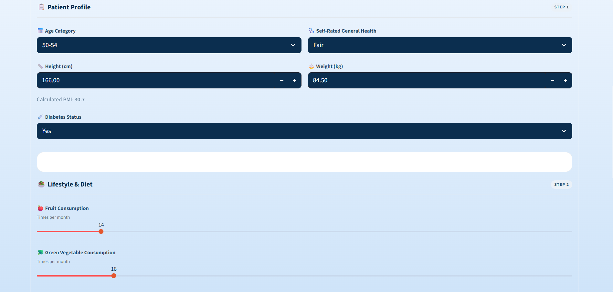
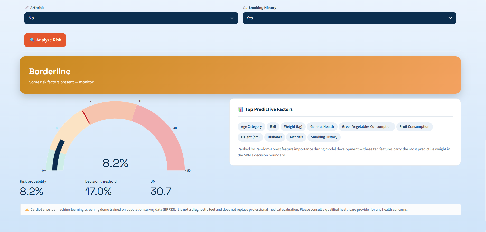
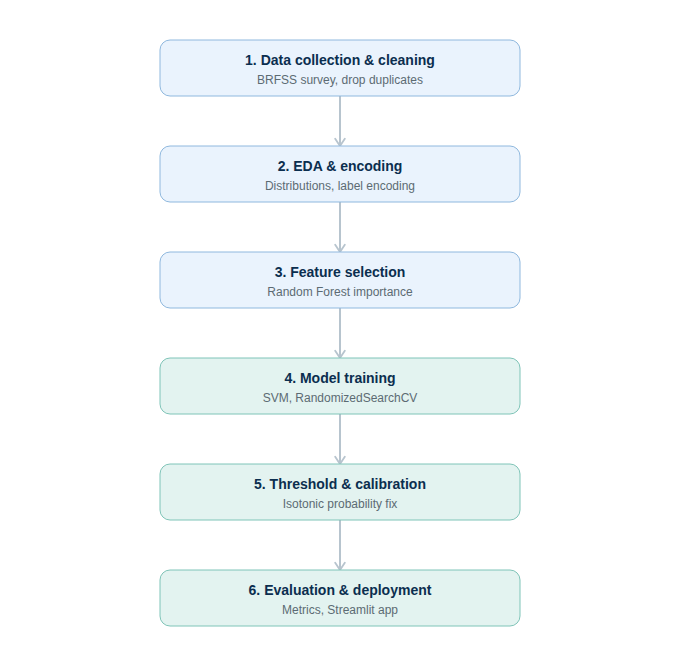
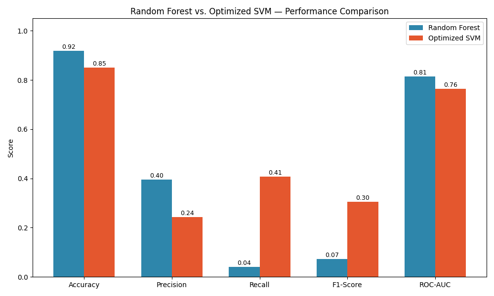
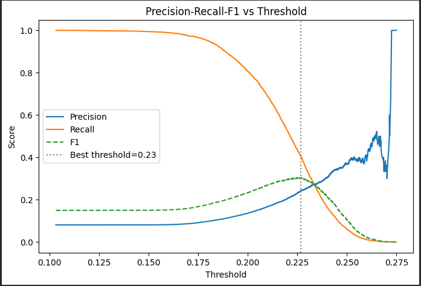
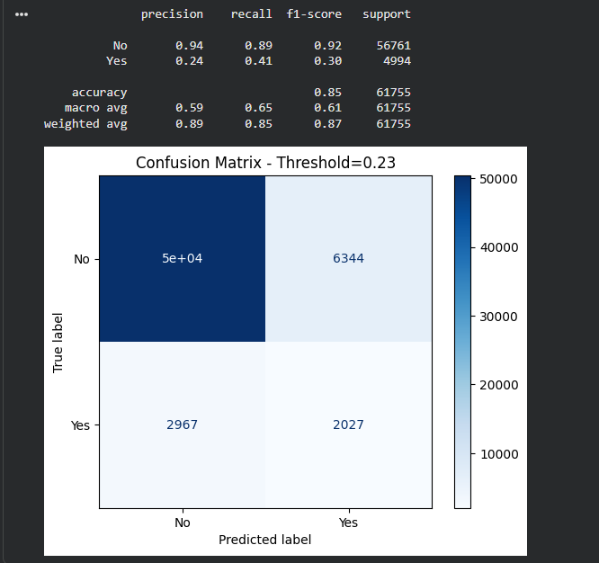

<div align="center">

# 🫀 CardioSense

### Early-Stage Cardiovascular Disease Risk Screening — Powered by Machine Learning

*Random Forest feature selection · Threshold-tuned, isotonic-calibrated SVM · Deployed as an interactive Streamlit app*

[](https://www.python.org/)
[](https://scikit-learn.org/)
[](https://streamlit.io/)
[](LICENSE)
[-20BEFF?logo=kaggle&logoColor=white)](https://www.kaggle.com/datasets/alphiree/cardiovascular-diseases-risk-prediction-dataset)

</div>

---

## 📖 Overview

**CardioSense** is a complete, end-to-end machine learning pipeline that estimates a person's cardiovascular disease risk from everyday health and lifestyle information — no clinical visit or lab test required. It's built on a **BRFSS-derived health survey dataset of 308,854 real-world respondents**, and combines Random Forest feature selection with a tuned, probability-calibrated Support Vector Machine to produce risk scores that are both accurate *and* trustworthy.

This isn't just a model that scored well on a test set — the project explicitly identifies and corrects two failure modes that are easy to miss and commonly go unaddressed in similar projects:

- 🔎 **Reverse-causality confounding** — alcohol and fried-food consumption were *negatively* correlated with heart disease in the raw data, because diagnosed patients are typically advised to cut back *after* diagnosis. Left uncorrected, the model would have learned that unhealthy habits lower your risk.
- ⚖️ **Probability miscalibration** — class-imbalance correction fixed classification accuracy but silently wrecked the model's predicted probabilities, compressing every score into an uninformative 17–54% band. Fixed with isotonic calibration so displayed risk percentages actually mean what they say.

<p align="center">
  
</p>

---

## ✨ Features

- 🌲 **Random Forest–driven feature selection** — top 10 predictors chosen from 15+ candidate health/lifestyle features, ranked by importance
- 🎯 **Optimized SVM classifier** — RBF kernel, hyperparameters tuned via `RandomizedSearchCV`, with a decision threshold selected by maximizing F1 on the minority class
- 📊 **Isotonic probability calibration** — predicted risk percentages match true population prevalence (~8%), not an arbitrary class-balanced score
- 🧪 **Bias-aware feature engineering** — confounded features identified and excluded through direct EDA investigation, not assumed away
- 💻 **Polished Streamlit web app** — animated UI, live risk gauge, color-coded risk tiers, and a heartbeat-themed loading animation
- 📓 **Fully commented training notebook** — every cell explains *why*, not just *what*, including the dead-ends that were tried and corrected along the way

---

## 🖥️ App Walkthrough

<table>
<tr>
<td width="50%">

<p align="center"><em>Step 1 — Patient health assessment form</em></p>
</td>
<td width="50%">

<p align="center"><em>Step 2 — Calibrated risk gauge & top predictive factors</em></p>
</td>
</tr>
</table>

---

## 🧠 Pipeline

<p align="center">
  
</p>

| Stage | What happens |
|---|---|
| **1. Data collection & cleaning** | Load BRFSS survey data, drop duplicates, remove irrelevant columns |
| **2. EDA & encoding** | Distribution checks, ordinal-aware encoding for `General_Health`, `Age_Category`, `Diabetes` |
| **3. Feature selection** | `RandomForestClassifier` (300 trees, balanced) ranks feature importance → top 10 retained |
| **4. Model training** | SVM (RBF kernel) tuned via `RandomizedSearchCV` on a stratified subsample |
| **5. Threshold & calibration** | F1-optimal decision threshold + `CalibratedClassifierCV` (isotonic) for meaningful probabilities |
| **6. Evaluation & deployment** | Metrics vs. Random Forest baseline, then shipped as a Streamlit app |

📄 Full narrative write-up: [`docs/PIPELINE.md`](docs/PIPELINE.md) · 📝 Formal report: [`docs/CardioSense_Project_Report.docx`](docs/CardioSense_Project_Report.docx)

---

## 📊 Results

Final calibrated SVM vs. Random Forest baseline, evaluated on a held-out test set of 61,755 records:

| Metric | Random Forest | Optimized SVM |
|---|:---:|:---:|
| Accuracy | 0.917 | 0.849 |
| Precision (Yes) | 0.396 | 0.243 |
| **Recall (Yes)** | **0.040** | **0.407** |
| F1-score (Yes) | 0.072 | 0.304 |
| ROC-AUC | 0.814 | 0.764 |

> Random Forest wins on raw accuracy and AUC — but at the default threshold it catches only **4%** of true heart-disease cases. The tuned SVM trades some accuracy for **10x better recall**, the more clinically meaningful outcome for a screening tool where missing a real case is costlier than a false alarm.

<table>
<tr>
<td width="55%"></td>
<td width="45%"></td>
</tr>
</table>

<p align="center">
  
</p>

---

## 🚀 Getting Started

### Run the app locally

```bash
git clone https://github.com/<your-username>/CardioSense.git
cd CardioSense
pip install -r requirements.txt
streamlit run app.py
```

> Keep the `.streamlit/config.toml` folder alongside `app.py` — it locks in the app's light theme so the custom UI renders correctly regardless of your system's dark-mode setting.

### Deploy on Streamlit Community Cloud

1. Push this repo to GitHub.
2. Go to [share.streamlit.io](https://share.streamlit.io) → **New app** → select this repo and `app.py` as the entry point.
3. Deploy — dependencies install automatically from `requirements.txt`.

### Retrain the model

Open [`notebooks/CardioSense_Training.ipynb`](notebooks/CardioSense_Training.ipynb) in Jupyter or Colab. Every cell is commented explaining the reasoning behind each step, including the two dead-end attempts (a naive threshold-search approach and an unstable `HalvingRandomSearchCV` run) that were diagnosed and corrected during development.

---

## 📁 Project Structure

```
CardioSense/
├── app.py                          # Streamlit application
├── cvd_svm_model.pkl                # Trained SVM + calibrator + scaler + metadata bundle
├── requirements.txt                 # Python dependencies
├── .streamlit/
│   └── config.toml                  # Forces light theme for consistent UI rendering
├── notebooks/
│   └── CardioSense_Training.ipynb   # Full, commented training pipeline
├── docs/
│   ├── PIPELINE.md                  # Narrative pipeline write-up
│   └── CardioSense_Project_Report.docx  # Formal project report
└── assets/                          # Images used in this README
```

---

## 🩺 Dataset

**[BRFSS-derived Cardiovascular Diseases Risk Prediction](https://www.kaggle.com/datasets/alphiree/cardiovascular-diseases-risk-prediction-dataset)** (Kaggle), originally sourced from the CDC's Behavioral Risk Factor Surveillance System — a large-scale annual U.S. health survey.

- **308,854** respondents · **19** features · no missing values
- Target: `Heart_Disease` (binary), ~91% No / ~9% Yes — a realistic, heavily imbalanced real-world distribution
- Final selected features: `Age_Category`, `BMI`, `Weight_(kg)`, `General_Health`, `Green_Vegetables_Consumption`, `Fruit_Consumption`, `Height_(cm)`, `Diabetes`, `Arthritis`, `Smoking_History`

---

## 🔬 Key Methodological Notes

<details>
<summary><b>Why were Alcohol & Fried Food Consumption excluded?</b></summary>
<br>

In the raw data, people **with** heart disease reported *lower* alcohol consumption (4.09 vs. 5.19 times/month) and *lower* fried-food consumption (6.03 vs. 6.32 times/month) than people **without** heart disease — the opposite of what intuition suggests. This is a classic reverse-causality confound: people diagnosed with heart disease are typically advised to cut back on both, so their *post-diagnosis* survey responses don't reflect the habits that may have contributed to their risk in the first place. Including these features caused the model to associate unhealthy habits with *lower* predicted risk. They were excluded before feature selection, and the model was retrained — performance held steady (AUC actually improved slightly) and per-feature sanity checks now behave as clinically expected.
</details>

<details>
<summary><b>Why calibrate probabilities separately from tuning the decision threshold?</b></summary>
<br>

`class_weight='balanced'` fixes the *decision boundary* so the model doesn't collapse to predicting the majority class — but it does nothing for the *magnitude* of the predicted probabilities. Combined with a smooth decision boundary (low `C`, low `gamma`), this compressed nearly every prediction into an uninformative 17–54% range — genuinely healthy respondents scored a median 41% "risk." Wrapping the tuned SVM in `CalibratedClassifierCV` (isotonic method, fit on a held-out split) remapped raw scores so the average predicted probability (~8.1%) matches the true population prevalence (~8.1%), while leaving ranking performance (AUC) unchanged.
</details>

<details>
<summary><b>Why train SVM on a subsample instead of the full 247K rows?</b></summary>
<br>

`SVC` training complexity scales roughly O(n²)–O(n³) with sample size. An early attempt to grid-search on the full training set hung for 30+ minutes with no result. Hyperparameter search was instead run on a stratified 8,000-row subsample (large enough to keep positive-class examples in every CV fold), and the final model fit on a larger 40,000-row subsample — a deliberate, documented tradeoff between training time and model quality.
</details>

---

## 🛣️ Future Work

- Incorporate longitudinal (rather than cross-sectional) health data to better separate causal risk factors from post-diagnosis behavior changes
- Compare against gradient-boosted trees (XGBoost, LightGBM) and shallow neural networks
- Add SHAP/LIME explainability for per-prediction, per-feature reasoning
- Explore SMOTE/ADASYN resampling as an alternative to class-weighting
- Clinical validation before any real-world use beyond this educational/portfolio context

---

## ⚠️ Disclaimer

CardioSense is a machine-learning screening demo trained on population survey data. It is **not a diagnostic tool** and does not replace professional medical evaluation. Please consult a qualified healthcare provider for any health concerns.

---

## 📜 License

Released under the [MIT License](LICENSE).

<div align="center">

*Built as part of an independent machine learning portfolio project.*

</div>
