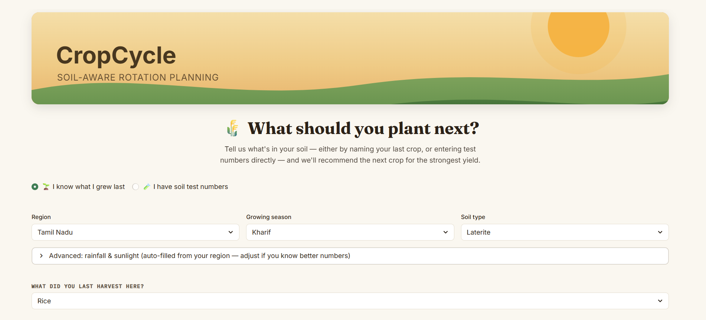
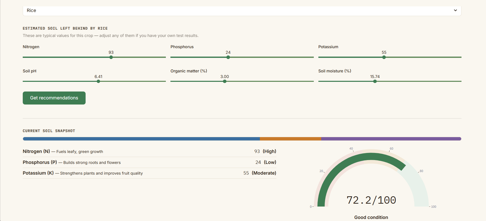
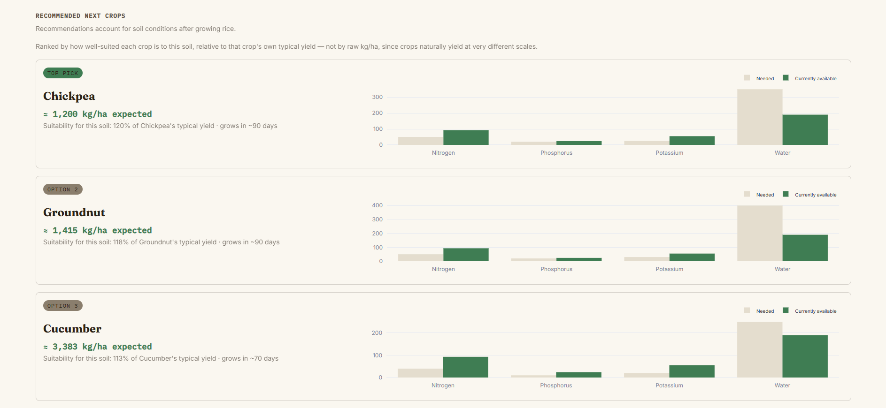

<div align="center">

# 🌾 CropCycle

### Soil-aware crop rotation recommendations, powered by machine learning

*Know what to plant next — and why — based on what your last crop actually left behind.*

[](https://www.python.org/)
[](https://streamlit.io/)
[](https://scikit-learn.org/)
[](LICENSE)

<br>

[](https://cropcycle.streamlit.app/)

*No install needed — try it straight from your browser: **[cropcycle.streamlit.app](https://cropcycle.streamlit.app/)***

</div>

---

## What it does

Most crop recommenders ask for your soil numbers and stop there. **CropCycle** goes a step further: it accounts for **crop rotation** — the fact that your last harvest already changed what's in your soil, whether that's nitrogen left behind by a legume or potassium stripped out by a heavy feeder like maize.

Give it your last crop (or your own lab test numbers), and it predicts which of 10 crops is best suited to plant next, ranked by how well each one fits *this specific soil* — not just which crop naturally yields the most.

<p align="center">
  
</p>

## Why it's not just "predict the yield"

Early in building this, ranking crops by raw predicted yield (kg/ha) kept recommending Tomato, Maize, and Rice for almost every input — because those crops naturally yield far more per hectare than something like Chickpea, regardless of soil fit. That's a scale problem, not a soil-suitability signal.

The fix: rank crops by a **suitability ratio** — how a crop's predicted yield compares to *its own* typical yield — so a soil that's genuinely great for Chickpea will surface Chickpea, not just whichever crop has the highest ceiling. This is the same kind of practical catch that shapes the rest of the model:

- **Leakage check** — the crop's own baseline yield correlated strongly with the raw target, so the model learned to predict crop identity instead of soil quality. Fixed by predicting a yield *ratio* instead of raw yield.
- **Redundant feature check** — an explicit "previous crop" label added almost nothing once real soil N-P-K/pH/moisture readings were included, because those readings already encode what the previous crop left behind. Dropped it rather than let the model lean on a shortcut.

## Features

| | |
|---|---|
| 🌱 **Two input paths** | Tell it your last crop for an auto-filled soil estimate, or enter your own lab test numbers directly |
| 📊 **Soil health score** | A 0–100 model-based read on your soil's overall condition |
| 🎯 **Ranked recommendations** | Top 3 next crops, ranked by soil fit — not raw yield |
| 📈 **Needed vs. available charts** | See exactly why a crop is (or isn't) a good match, nutrient by nutrient |
| 🗺️ **Region-aware defaults** | Rainfall and sunlight auto-fill based on your region, editable if you know better numbers |
| 🎨 **Custom themed UI** | A farmland-inspired design that stays legible regardless of the visitor's light/dark browser setting |

<p align="center">
  
</p>

<p align="center">
  
</p>

## How it works

1. **Data**: a synthetic Indian agricultural dataset with real 3-crop rotation sequences, before/after soil readings, and simulated yield outcomes across 10 crops, 37 regions, and 3 growing seasons.
2. **Model**: a `RandomForestRegressor` predicts a *yield ratio* (simulated yield ÷ that crop's typical baseline yield) from soil chemistry, climate, season, region, and soil type.
3. **Recommendation**: at inference time, the app evaluates all 10 crops against your current soil reading and ranks them by predicted suitability ratio, converting back to an estimated kg/ha figure for context.
4. **Soil score**: a separate small regressor summarizes pH, nutrients, organic matter, and moisture into a single 0–100 health reading.

> **Honest limitation:** the underlying dataset is synthetic, not field-measured. Treat yield and soil-score figures as a *relative* comparison between crop options for a portfolio-grade proof of concept — not a guaranteed harvest number. For real planting decisions, confirm with a local agricultural extension officer or a physical soil test.

## Tech stack

- **Modeling**: scikit-learn (RandomForestRegressor), pandas, numpy
- **App**: Streamlit, Plotly
- **Styling**: custom CSS with a forced light theme (`.streamlit/config.toml`) so the UI stays legible regardless of the visitor's system dark-mode setting

## Project structure

```
crop_recommender/
├── app.py                          # Main Streamlit app
├── requirements.txt                # Python dependencies
├── .streamlit/
│   └── config.toml                 # Forces light theme — do not skip when pushing
├── app_assets/
│   ├── yield_model.pkl             # Trained RandomForestRegressor (yield ratio)
│   ├── soil_score_model.pkl        # Trained soil health score model
│   ├── crop_requirements.csv       # Per-crop nutrient/water/duration reference
│   ├── previous_crop_soil_lookup.csv  # Typical soil left behind, by crop
│   ├── region_climate_defaults.csv # Regional rainfall & solar radiation defaults
│   ├── region_soil_type_defaults.csv
│   └── reference.json              # Dropdown option lists
└── assets/
    └── screenshots/                # Images used in this README
```

**⚠️ Important:** `app.py` loads model files from `app_assets/...` (a subfolder), and `.streamlit/config.toml` is a hidden file. Both are easy to drop accidentally when copying files around in File Explorer/Finder or dragging into GitHub's web uploader. Double-check both are present with the exact folder structure above before you push — see the checklist below.

---

## Getting started locally

```bash
git clone https://github.com/<your-username>/crop_recommender.git
cd crop_recommender
pip install -r requirements.txt
streamlit run app.py
```

The app opens at `http://localhost:8501`.

---

## Pushing this to GitHub

**Before you start — a quick checklist**, since your local folder needs to match the structure above exactly:

- [ ] `app_assets/` is a real subfolder containing all 7 files (not flattened alongside `app.py`)
- [ ] `.streamlit/config.toml` exists (hidden folder — enable "show hidden files" in your file explorer to confirm)
- [ ] `assets/screenshots/` contains the 3 PNGs referenced in this README

### Option A: Command line (git)

```bash
# 1. Create a new repository on github.com first (don't add a README there — you already have one)

# 2. From inside your project folder:
git init
git add .
git commit -m "Initial commit: CropCycle soil-aware crop rotation recommender"
git branch -M main
git remote add origin https://github.com/<your-username>/crop_recommender.git
git push -u origin main
```

If `git` isn't recognized, install it from [git-scm.com](https://git-scm.com/downloads) first and restart your terminal.

### Option B: GitHub Desktop (no command line)

1. Install [GitHub Desktop](https://desktop.github.com/) and sign in
2. File → Add Local Repository → select your `crop_recommender` folder
3. If prompted that it's not a repository yet, click **"create a repository"**
4. Write a commit summary (e.g. "Initial commit") → **Commit to main**
5. Click **Publish repository** in the top bar → choose public or private → Publish

### After pushing: verify it worked

Go to your repo on github.com and confirm you can see the `app_assets/` folder and `.streamlit/config.toml` in the file listing (GitHub shows dotfiles/dotfolders normally, unlike some file explorers). If `app_assets/` is missing, your local folder was flat and needs fixing before the app will run anywhere else.

---

## Deploying to Streamlit Community Cloud

1. Push to GitHub first (above)
2. Go to [share.streamlit.io](https://share.streamlit.io) → **New app**
3. Select your repo, branch `main`, and set the main file path to `app.py`
4. Deploy

If you update the code later, push to GitHub as normal — Streamlit Cloud redeploys automatically. If a change doesn't seem to appear, use **Manage app → Reboot app** to force a clean rebuild.

---

## License

MIT — see [LICENSE](LICENSE) for details.

## Author

Built by Surieyaa as part of an ML/agriculture portfolio project.
